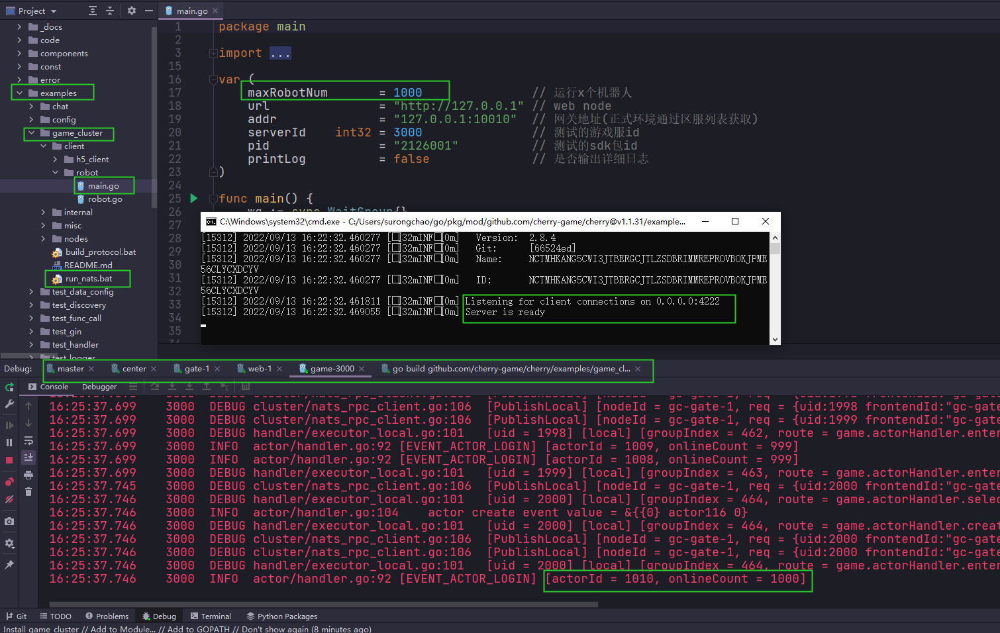

# 多节点示例

## 须知

- 本示例适合作为游戏服务端的基础脚手架，开发者们可在此示例基础上发展出自己的游戏服务端方案。
- 示例中没有使用数据库，进程重启会还原所有数据
- 客户端演示分为两种：
  - `robot_client` 为go实现的游戏压测客户端，使用`tcp/protobuf`协议
  - `nodes/web/view/` 为h5实现的游戏客户端，使用`websocket/protobuf`协议
- 欢迎开发者一起入群讨论（`QQ群：191651647`），构建更好的`cherry`生态。

## 要求

- GO >= 1.18
- nats.io >= 2.0

## 配置

- 参数配置文件在 `../config/demo-cluster.json`
- 策划配置文件在 `../config/data/`

## 准备

- `git clone https://github.com/cherry-game/cherry.git`
- 或者点击github.com页面的`code`按钮`Download zip`下载源码包
- 打开项目源码，找到`demo_cluster`目录
- 请参考[环境安装与配置](https://github.com/cherry-game/cherry/blob/master/_docs/env-setup.md) 进行准备工作

## 启动与调试

### 1、启动nats

> nats为高性能的分布式消息中间件，详情可通过`https://github.com/nats-io/nats-server` 进行了解。
> 本框架中所有节点都基于 nats 进行消息通信。
> 正式环境请使用集群 nats-streaming-server 进行部署 `https://github.com/nats-io/nats-streaming-server`

- Windows：`3rd/nat-server/run_nats.bat`
- Mac：`nats-server`
  
> 窗口显示`Listening for client connections on 0.0.0.0:4222` 代表 nats 启动成功，nats 默认监听`4222`端口

### 2、启动参数配置

- 找到`demo_cluster/nodes/main.go`，所有节点都从`main.go`启动
- `VSCode`用户在左侧栏找到`运行和调试(Debug)`按钮,启动`gc-master`、`gc-center`、`gc-web-1`、`gc-gate-1`、`gc-game-10001`
- `GoLand`用户配置启动参数(`Program arguments`)如下：
  - `gc-master`       master --path=./config/demo-cluster.json --node=gc-master
  - `gc-center`       center --path=./config/demo-cluster.json --node=gc-center
  - `gc-web-1`        web --path=./config/demo-cluster.json --node=gc-web-1
  - `gc-gate-1`       gate --path=./config/demo-cluster.json --node=gc-gate-1
  - `gc-game-10001`   game --path=./config/demo-cluster.json --node=10001

## 测试

- 使用 go 实现客户端，通过 tcp 协议连接 gate 网关进行压力测试
- 使用 h5 实现客户端，通过 websocket 协议连接 gate 网关进行功能的展示

### 启动压测机器人

- 找到`demo_cluster/robot_client/main.go` 文件,并执行
- 机器人执行逻辑为：`注册帐号`，`登陆获取token`、`连接网关`、`用户登录游戏服`、`查看角色`、`创建角色`、`进入角色`
- 默认设定为创建1000个帐号，可自行调整`maxRobotNum`参数进行测试
- 执行完成后，从game节点的`Console`可以查看到`onlineCount = 50000`字样

#### 启动 h5 客户端

- 直接访问`http://127.0.0.1:8081`，按照界面步骤提示操作。
  - 端口以 web 进程打印的具体的值为准，如果发现端口被占用，请搜索并替换。

## 源码讲解
- `internal` 内部业务逻辑
  - `code` 定义一些业务的状态码
  - `component` 组件目录，
    - `check_center`组件, 用于在启动前节点先检查`center`节点是否已启动
  - `constant` 一些常用定义
  - `data` 策划配表包装的struct，用于读取`../config/data`目录的策划配表
  - `event` 游戏事件
  - `guid` 生成全局id
  - `pb` protobuf生成的协议结构
  - `protocol` protobuf结构定义目录
  - `rpc` 跨节点rpc函数封装
  - `session_key` 一些session相关的常量定义
  - `token` 登录token逻辑，包含生成token、验证token
  - `types` 各种自定义类型封装,方便struct从配置文件、数据库读取数据时进行序列化、反序列化

- `nodes` 分布式节点目录
  - `center`节点
  - `game` 节点
  - `gate` 节点
  - `master` 节点
  - `web` 节点(为了演示方便，包含了h5客户端)
- `robot_client` 压测机器人(tcp/protobuf协议)
- `build_protocol.bat` 生成protobuf结构代码到`internal/pb/`目录

### master节点

- master 节点主要用于实现最基础的发现服务,基于nats构建。
- 正式环境也可配置为etcd方式提供发现服务。
- 相关的代码在`demo_cluster/master/`目录。

### center节点

- center 节点目前主要用于处理帐号相关的业务或全局唯一的业务

### web节点

- web 节点主要对外提供一些http的接口，可横向扩展，多节点部署。
- 目前用于开发者帐号注册、区服列表、sdk登陆/支付回调、验证token生成等业务。

### gate节点

- gate 节点为游戏对外网关，可横向扩展，多节点部署。
- 主要用于管理客户端的连接、消息路由与转发。

### game节点

- game 节点为具体的游戏逻辑业务，根据业务需求可多节点部署。
- 在分服的游戏中可提供游戏内的各种逻辑实现。

## 运行截图

